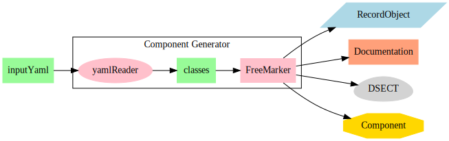

# Geneva ERS Component Generation

The Component Generator makes the key data components of [Geneva ERS](https://genevaers.org/) Java Frontend and, where feasable, 
automatically generates code to manage them.

# Developer's How To

In order to build the Component Generator you need the following.

A Java 11 or greater JDK for your platform. For instance from [here](https://adoptopenjdk.net/)

An up to date install of [Maven](https://maven.apache.org/download.cgi) - latest at time of writing is Apache Maven 3.8.4.

Clone the repository from github somewhere on your machine.

Use GitBash or something similar and change to the directory where you cloned the repository.

Before building ensure that a Java JDK and Maven are installed.
Enter the commands below and you should see something similar.

    $ java --version
    openjdk 11.0.10 2021-01-19
    OpenJDK Runtime Environment AdoptOpenJDK (build 11.0.10+9)
    Eclipse OpenJ9 VM AdoptOpenJDK (build openj9-0.24.0, JRE 11 Windows 10 amd64-64-Bit Compressed References 20210120_899 (JIT enabled, AOT enabled)
    OpenJ9   - 345e1b09e
    OMR      - 741e94ea8
    JCL      - 0a86953833 based on jdk-11.0.10+9)

    $ mvn -version
    Apache Maven 3.8.4 (9b656c72d54e5bacbed989b64718c159fe39b537)
    Maven home: C:\maven\apache-maven-3.8.4
    Java version: 11.0.10, vendor: AdoptOpenJDK, runtime: C:\adoptOpenJDK\jdk-11.0.10+9
    Default locale: en_AU, platform encoding: Cp1252
    OS name: "windows 10", version: "10.0", arch: "amd64", family: "windows"

To build for your platform enter

    mvn install

Maven will then download the various libraries needed.
This may take some time for the first build. Subsequent builds will be faster.

On completion you should see something similar to.

    [INFO] ------------------------------------------------------------------------
    [INFO] BUILD SUCCESS
    [INFO] ------------------------------------------------------------------------
    [INFO] Total time:  31.444 s
    [INFO] Finished at: 2022-02-01T15:35:52+08:00
    [INFO] ------------------------------------------------------------------------

To generate components from the underlying YAML definitions enter

    ./target/bin/compgen

This will output a record of the files generated ending with.

        [INFO] --- ------------------------------------ ---
        [INFO]
        [INFO] Write .\Readme.md via readme.ftl
        [INFO] --- Generation Completed ---

# Description

This code uses the [FreeMarker Template Engine](https://freemarker.apache.org/).

The diagram below shows the general data flow of the Component Generator.

The GenevaERS model is made up from a number of segments defined in [the model config](src/main/resources/modelConfig.yaml).

Each of which is defined in its own YAML file. 

The segments and their source files are:

| Segment     | YAML  |
| ----------- | ----- |
|VDPRecords  |[src/main/resources/vdpconfig.yaml](src/main/resources/vdpconfig.yaml) |       
|LTRecords  |[src/main/resources/ltconfig.yaml](src/main/resources/ltconfig.yaml) |       
|Components  |[src/main/resources/componentconfig.yaml](src/main/resources/componentconfig.yaml) |       
|Enums And Equates  |[src/main/resources/enumsAndEquates.yaml](src/main/resources/enumsAndEquates.yaml) |       

Each segment has a number of definition input files that are read by the Component Generator and applied to
FreeMarker Templates to generate the desired type of output.  
This documentation is produced in the same way.

# Why bother?

- Generating the various data objects from a single point of definition means that the 
consumers of the data will see products that are in synch. 

- It provides a centralised means of managing and documenting the record structures.

# Segments

The sections below describe each of the model segments.

## VDPRecords

The View Defintion Parameter (VDP) records are written to the VDP file. The VDP file is read by the Performance Engine process to define the metadata describing the data flows to be processed.

| VDP Record  | DSECT |
| ----------- | ----- |
| [VDPGenerationRecord](docs/VDPGenerationRecord.md) | [1](docs/mac/GVB0001A.mac) |
| [VDPFormatViews](docs/VDPFormatViews.md) | [2](docs/mac/GVB0002A.mac) |
| [VDPControlRecord](docs/VDPControlRecord.md) | [50](docs/mac/GVB0050A.mac) |
| [VDPPhysicalFile](docs/VDPPhysicalFile.md) | [200](docs/mac/GVB0200A.mac) |
| [VDPExit](docs/VDPExit.md) | [210](docs/mac/GVB0210A.mac) |
| [VDPLogicalRecord](docs/VDPLogicalRecord.md) | [300](docs/mac/GVB0300A.mac) |
| [VDPLRField](docs/VDPLRField.md) | [400](docs/mac/GVB0400A.mac) |
| [VDPLRIndex](docs/VDPLRIndex.md) | [500](docs/mac/GVB0500A.mac) |
| [VDPLookupPathKey](docs/VDPLookupPathKey.md) | [601](docs/mac/GVB0601A.mac) |
| [VDPLookupPathTargetSet](docs/VDPLookupPathTargetSet.md) | [650](docs/mac/GVB0650A.mac) |
| [VDPLookupGenMap](docs/VDPLookupGenMap.md) | [651](docs/mac/GVB0651A.mac) |
| [VDPExtractFile](docs/VDPExtractFile.md) | [800](docs/mac/GVB0800A.mac) |
| [VDPExtractRecordFile](docs/VDPExtractRecordFile.md) | [850](docs/mac/GVB0850A.mac) |
| [VDPViewDefinition](docs/VDPViewDefinition.md) | [1000](docs/mac/GVB1000A.mac) |
| [VDPFormatFile](docs/VDPFormatFile.md) | [1600](docs/mac/GVB1600A.mac) |
| [VDPExtractTargetSet](docs/VDPExtractTargetSet.md) | [1650](docs/mac/GVB1650A.mac) |
| [VDPViewColumn](docs/VDPViewColumn.md) | [2000](docs/mac/GVB2000A.mac) |
| [VDPViewSortKey](docs/VDPViewSortKey.md) | [2300](docs/mac/GVB2300A.mac) |
| [VDPViewSource](docs/VDPViewSource.md) | [3000](docs/mac/GVB3000A.mac) |
| [VDPViewColumnSource](docs/VDPViewColumnSource.md) | [4000](docs/mac/GVB4000A.mac) |
| [VDPExtractFilter](docs/VDPExtractFilter.md) | [3201](docs/mac/GVB3201A.mac) |
| [VDPFormatFilter](docs/VDPFormatFilter.md) | [1201](docs/mac/GVB1201A.mac) |
| [VDPColumnLogic](docs/VDPColumnLogic.md) | [4201](docs/mac/GVB4201A.mac) |
| [VDPColumnCalculationLogic](docs/VDPColumnCalculationLogic.md) | [2201](docs/mac/GVB2201A.mac) |
| [VDPExtractOutputLogic](docs/VDPExtractOutputLogic.md) | [3301](docs/mac/GVB3301A.mac) |

## LTRecords

The Logic Table (LT) records are written to the XLT and or JLT files and are read by the Performance Engine process to define functions to be executed.

| LT Record  | DSECT |
| ---------- | ----- |
| [LogicTableCC](docs/LogicTableCC.md) | [CC](docs/ltmac/GVBLTCCA.mac) |
| [LogicTableF0](docs/LogicTableF0.md) | [F0](docs/ltmac/GVBLTF0A.mac) |
| [LogicTableF1](docs/LogicTableF1.md) | [F1](docs/ltmac/GVBLTF1A.mac) |
| [LogicTableF2](docs/LogicTableF2.md) | [F2](docs/ltmac/GVBLTF2A.mac) |
| [LogicTableGeneration](docs/LogicTableGeneration.md) | [GENERATION](docs/ltmac/GVBLTGENERATIONA.mac) |
| [LogicTableHD](docs/LogicTableHD.md) | [HD](docs/ltmac/GVBLTHDA.mac) |
| [LogicTableName](docs/LogicTableName.md) | [NAME](docs/ltmac/GVBLTNAMEA.mac) |
| [LogicTableNameF1](docs/LogicTableNameF1.md) | [NAMEF1](docs/ltmac/GVBLTNAMEF1A.mac) |
| [LogicTableNameF2](docs/LogicTableNameF2.md) | [NAMEF2](docs/ltmac/GVBLTNAMEF2A.mac) |
| [LogicTableNameValue](docs/LogicTableNameValue.md) | [NAMEVALUE](docs/ltmac/GVBLTNAMEVALUEA.mac) |
| [LogicTableNV](docs/LogicTableNV.md) | [NV](docs/ltmac/GVBLTNVA.mac) |
| [LogicTableRE](docs/LogicTableRE.md) | [RE](docs/ltmac/GVBLTREA.mac) |
| [LogicTableWR](docs/LogicTableWR.md) | [WR](docs/ltmac/GVBLTWRA.mac) |

## Components

The component records are used to define the Java classes used in the MR91 repository.

Which are the components of the in memory database used by the Preprocessor.

The links below are a work in progress and currently just 404.

| Component  | Java  |
| ---------- | ----- |
| [ControlRecord](docs/ControlRecord.md) | [ControlRecord](build/generated/sources/compjobj/ControlRecord.java) |
| [PhysicalFile](docs/PhysicalFile.md) | [PhysicalFile](build/generated/sources/compjobj/PhysicalFile.java) |
| [UserExit](docs/UserExit.md) | [UserExit](build/generated/sources/compjobj/UserExit.java) |
| [LogicalRecord](docs/LogicalRecord.md) | [LogicalRecord](build/generated/sources/compjobj/LogicalRecord.java) |
| [LRField](docs/LRField.md) | [LRField](build/generated/sources/compjobj/LRField.java) |
| [LRIndex](docs/LRIndex.md) | [LRIndex](build/generated/sources/compjobj/LRIndex.java) |
| [LookupPathKey](docs/LookupPathKey.md) | [LookupPathKey](build/generated/sources/compjobj/LookupPathKey.java) |
| [ViewDefinition](docs/ViewDefinition.md) | [ViewDefinition](build/generated/sources/compjobj/ViewDefinition.java) |
| [ViewColumn](docs/ViewColumn.md) | [ViewColumn](build/generated/sources/compjobj/ViewColumn.java) |
| [ViewSortKey](docs/ViewSortKey.md) | [ViewSortKey](build/generated/sources/compjobj/ViewSortKey.java) |
| [ViewSource](docs/ViewSource.md) | [ViewSource](build/generated/sources/compjobj/ViewSource.java) |
| [ViewColumnSource](docs/ViewColumnSource.md) | [ViewColumnSource](build/generated/sources/compjobj/ViewColumnSource.java) |
| [OutputFile](docs/OutputFile.md) | [OutputFile](build/generated/sources/compjobj/OutputFile.java) |

## Enums And Equates

There are a number of key values that are used to generate Java enums and assembler equates

The table below lists the enumerations defined.

The Assembler equates generated are [here](docs/mac/GVBEQS.mac).

| ASM Prefix  | Description |
| ----------  | ----------- |
| EXITTYPE_ | Type of exit |
| PROGTYPE_ | Exit program language |
| JUSTIFY_ID_ | Justification - used in columns and fields |
| DBMS_ROW_FORMAT_ | Database row format |
| FORMAT_ID_ | Datatype - used in fields and columns |
| FILE_TYPE_ | File Type - used for Physical Files |
| FIELD_DELIM_ID_ | Field Delimiter |
| FIELD_DELIM_ID_ | Record Delimiter |
| TEXT_DELIM_ID_ | Text Delimiter |
| ACCESS_METHOD_ID_ | Data Access Method |
| FILE_RECFM_ | File Record Format |
| SUBTOTAL_TYPE_ID_ | Subtotal type used in hard copy reports |
| LR_STATUS_ID_ | Logical Record Status |
| EXTRACT_AREA_ID_ | Extract Area Codes |
| COL_SOURCE_TYPE_ | Column Source Codes |
| VIEW_STATUS_ | View Status |
| VIEW_TYPE_ | View Type |
| OUTPUT_MEDIA_ | Output media - Only HCOPY, FILE and DELIM make sense now |
| SORT_ORDER_ | Sort Order |
| SORT_BREAK_FOOTER_OPTION_ | Sort Break Footer Option - hard copy only? |
| SORT_BREAK_HEADER_OPTION_ | Sort Break Header Option - hard copy only? |
| SORT_KEY_DISP_OPT_ID_ | Sort Key Display |
| PERFORM_BREAK_LOGIC_ | To break or not break... that is the question |
| LT_RECORD_TYPE_ | Logic Table Record ID values |
| LT_COMPARE_TYPE_ | Logic Table Camparison Values |
| DATE_CODE_ | Date Content Codes |

## Relationship Records to Components

The records managed by this code base go to make up the contents of the View Definition Parameters(VDP) file and the logic table files.
The files that are used to tell the extract engine what data to process and how to transform that data.

The VDP and logic table files are generated as a result of the Pre Processor reading its input Workbech XML files.

